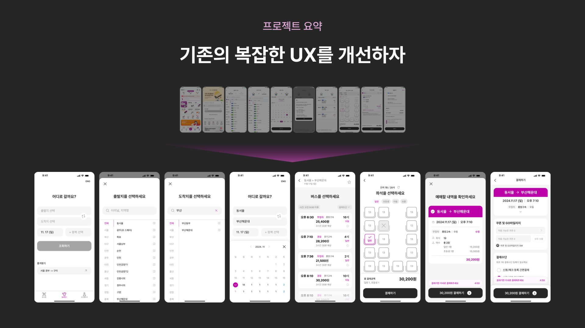
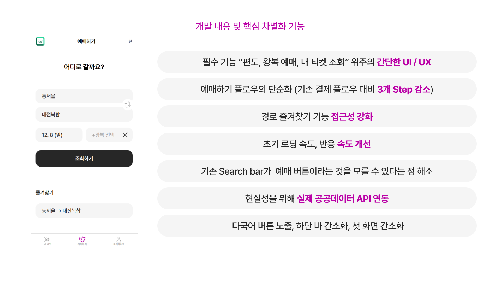
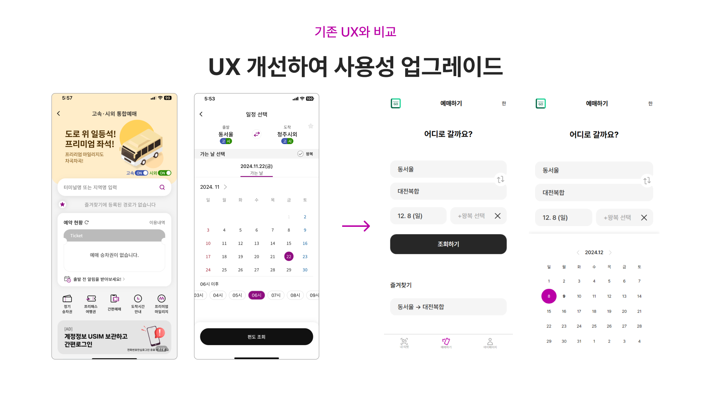
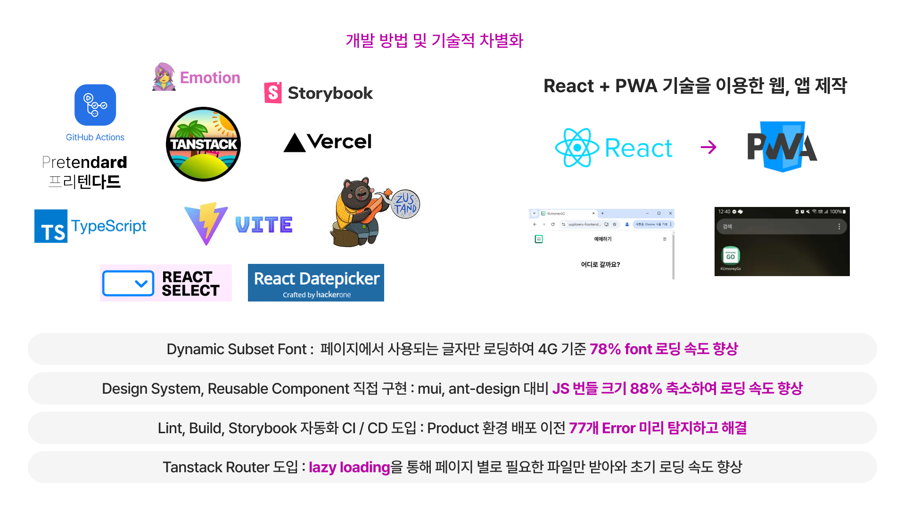
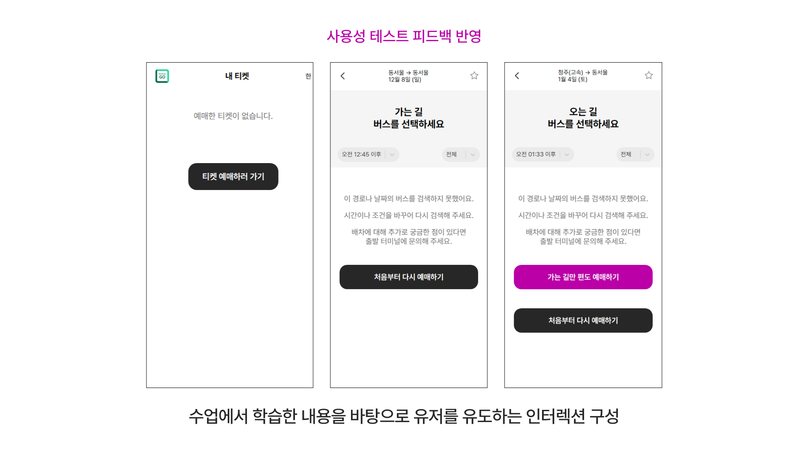

## Live Demo

https://uxplorers-frontend.vercel.app/

## Presentation pdf

[Browser pdf viewer](https://uxplorers-frontend.vercel.app/UXplorers.pdf)   
[Orign pdf file in github](https://github.com/uxplorerss/uxplorers-frontend/blob/main/UXplorers.pdf)   

### Some slides of Presentation






## Our Members

- 김별찬 (개발 팀장):
  - 개발일정 산정 및 테스크 분배, 미팅 로그 작성
  - 개발환경 세팅
  - 공통 컴포넌트 제작
  - 예매 확인 페이지 및 결제 페이지 구현
  - 즐겨찾기를 제외한 전역 상태 설계 및 구현
  - github actions를 통한 lint, build 및 storybook 배포 플로우 작성
- 양석준:
  - 프로젝트 기획
  - 좌석 선택 페이지 구현
- 김지환:
  - vercel 배포 및 vite proxy setting을 통한 공공데이터 버스 실시간 정보 api 연동 로직
  - 실시간 정보 api를 바탕으로 버스 목록 페이지 구현
  - 즐겨찾기 기능 전역 상태 및 UI 구현
- 조용찬:
  - 검색 페이지(홈페이지) 구현
  - 출발지 및 도착지 목록 페이지 구현
  - Date picker 구현

## How to run development environment

- package manager로 yarn을 사용합니다.

```shell
yarn install
yarn dev
```

## How to run storybook

```shell
yarn storybook
```

## 배포: gh-pages 브랜치 기준

```shell
yarn build
yarn deploy
```

> 현재는 fork한 repo를 수동으로 vercel에서 배포하고 있습니다.
